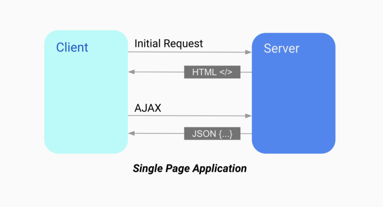
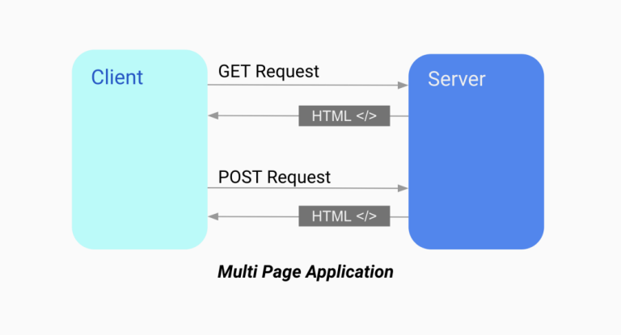
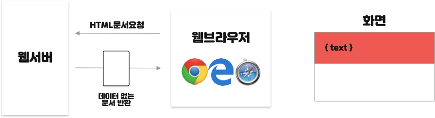

# Renderding 방식 - SSR & CSR
### SPA (Single Page Application)

- 하나의 페이지로 구성된 웹
- 서버로부터 처음에만 페이지를 받아오고, 이후에는 동적으로 페이지를 구성해서 새로운 페이지를 받아 오지 않는 방식
- 언제 새로운 데이터(API)를 불러와야 할지 스스로 정해야 함

### MPA (Multiple Page Application)

- 여러 개의 페이지로 구성된 웹
- 서버로부터 완전한 페이지를 받아오고, 이후에 데이터를 수정하거나 조회할 때, 완전히 다른 페이지로 이동 (URL이 바뀔 수 있음)
- 화면 깜빡임 발생

전통적인 방식을 이용한다면 SPA, MPA가 사용하는 렌더링 방식은 각각 CSR, SSR이다.   
하지만 SPA에서 처음 로드하는 페이지만 SSR을 하고, 그 이후는 CSR을 하면 SPA가 여전히 유지되어 **SPA에서 SSR**을 할 수 있다.

 

## ✔ SSR(Server Side Rendering)

- 브라우저가 페이지를 요청할 때마다 서버에서 렌더링을 마치고, 데이터가 결합된 HTML을 내려 주는 방식

### 장점
- 초기 로딩 속도가 **빨라서** 사용자가 콘텐츠를 빨리 볼 수 있음
- JS를 통한 렌더링이 아니므로 **검색 엔진 최적화(Search Engine Optimiztion)** 가능
  - 검색 로봇이 페이지 크롤링하기 적합, 검색 노출

### 단점
- 페이지 요청마다 **새로고침**되어 사용자 경험(UX)에 좋지 않음 
- 매번 서버에 요청하여 **서버 부하**가 커진다

 

## ✔ CSR(Client Side Rendering) 

웹서버에 요청할 때는 데이터가 없는 문서 반환

HTML, static 파일들이 로드되면서 데이터 또한 서버에 요청되어 화면상에 나타남

- 브라우저가 서버에 HTML과 JS 파일을 요청한 후, 로드되면 사용자의 상호작용에 따라 JS를 이용해서 동적으로 렌더링
- 처음 받게 될 HTML은 빈 페이지

### 장점
- 첫 로딩만 기다리면 동적으로 빠르게 로딩되어 사용자 경험(UX)에 좋음
- 서버에 요청하는 횟수가 적어 서버 부담이 적음 (트래픽 감소)

### 단점
- 모든 **스크립트 파일이 로드**될 때까지 기다려야 함
  - 데이터를 제외한 코드들은 **JS 파일에 한 번에 번들**되어 오기 때문에, 번들된 이 파일을 처음에 다운받는 데 시간이 오래 걸릴 수 있음
  - 리소스를 청크(Chunk) 단위로 묶어 요청할 때만 다운받는 방식으로 완화시킬 수 있지만, 완벽히 해결할 수 없음
- 검색 엔진 최적화(SEO) 문제
  - 구글은 크롤러 안에 JS 엔진이 있어 문제가 없지만, 다른 사이트들은 대부분 JS를 해석할 수 있는 엔진이 없어 **빈 페이지로 인식**하게 될 것

 

## ✔ Next.js
SSR과 CSR 각각의 단점을 해결하고 장점을 살리기 위해 생겨난 프레임워크

- 첫 페이지는 SSR 하고, 그 뒤 발생하는 라우팅은 CSR
- 첫 페이지가 내용이 모두 채워져 있는 HTML이고, 이후 상호작용이 가능한 JS 파일은 따로 로드해서 클라이언트에서 DOM을 그대로 그리기만 하면 됨
- 검색 엔진 최적화(SEO)와 사용자가 화면을 빨리 확인하는 데 도움

 

## ✔ 참고
[CSR(Client Side Rendering)과 SSR(Server Side Rendering)](https://github.com/baeharam/Must-Know-About-Frontend/blob/main/Notes/frontend/csr-ssr.md)   
[위펄슨 기술 블로그](https://tech.weperson.com/wedev/frontend/csr-ssr-spa-mpa-pwa/#csr-vs-ssr-%E1%84%8C%E1%85%A5%E1%86%BC%E1%84%85%E1%85%B5)   
[CSR, SSR, SPA, MPA? 상사한테 혼나기 전에 알아야하는 것](https://blog.hahus.kr/csr-ssr-spa-mpa-ede7b55c5f6f)   
[SPA 그리고 SSR과 CSR](https://velog.io/@ru_bryunak/SPA-%EC%82%AC%EC%9A%A9%EC%97%90%EC%84%9C%EC%9D%98-SSR%EA%B3%BC-CSR)   
[SSR vs CSR 비교 설명, Next.js가 탄생하게 된 이유](https://www.sarah-note.com/%ED%81%B4%EB%A1%A0%EC%BD%94%EB%94%A9/posting2/)   
[SPA기반 웹사이트의 SEO](https://www.ascentkorea.com/seo-for-spa/)