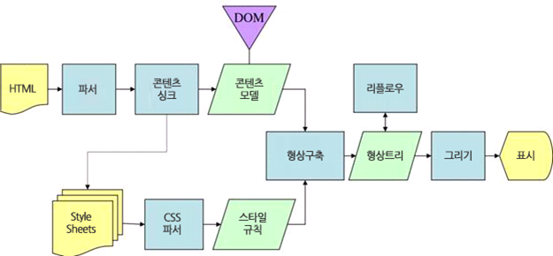
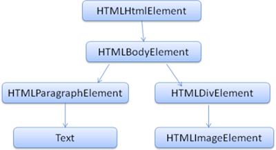

# 브라우저 렌더링 원리

### 브라우저 주소창에 naver.com을 입력하면, 어떤 과정을 거쳐 네이버 페이지가 화면에 보이게 될까?

<br/>

## ✔ 브라우저 주요 기능


사용자가 선택한 자원을 서버에 요청하고, 브라우저에 표시하는 것

- 자원은 보통 HTML 문서, PDF나 이미지 혹은 다른 형태일 수 있음
- 자원의 주소는 URI(Uniform Resource Identifier)에 의해 정해짐
- 브라우저는 HTML, CSS 명세에 따라 HTML 파일을 해석해서 표시
  - 명세는 웹 표준화 기구인 W3C(World Wide Web Consortium)에서 정함

<br/>

## ✔ 브라우저 기본 구조


### 1. 사용자 인터페이스

- 요청한 페이지를 보여 주는 창을 제외한 나머지 모든 부분
  - URI를 입력할 수 있는 주소 표시줄
  - 이전/다음 버튼
  - 북마크
  - 새로고침/정지 버튼
  - 홈 버튼

### 2. 브라우저 엔진

- 사용자 인터페이스와 렌더링 엔진 사이 동작을 제어

### 3. 렌더링 엔진

- 요청한 콘텐츠를 표시  
  예시) HTML을 요청하면 HTML과 CSS를 파싱하여 화면에 표시

### 4. 통신

- HTTP 요청과 같은 네트워크 호출에 사용
- 플랫폼과 독립적인 인터페이스이고, 각 플랫폼 하부에서 실행

### 5. UI 백엔드

- 콤보 박스와 창 같은 기본적인 장치를 그림
- 플랫폼에서 명시하지 않은 일반적인 인터페이스
- OS 사용자 인터페이스 체계 사용

### 6. 자바스크립트 해석기

- 자바스크립트 코드를 해석하고 실행

### 7. 자료 저장소

- 쿠키 등 모든 종류의 자원을 하드 디스크에 저장하는 계층
- HTML5 명세에는 브라우저가 지원하는 웹 데이터베이스가 정의되어 있음

<br/>

## ✔ 렌더링 엔진

요청받은 내용 브라우저 화면에 표시

- HTML, XML 문서, 이미지 표시 가능
- 브라우저 확장 기능으로 PDF 등 다른 유형도 표시 가능

| 브라우저     | 렌더링 엔진  |
| ------------ | ------------ |
| 파이어폭스   | 게코(Gecko)  |
| 사파리, 크롬 | 웹킷(Webkit) |

<br/>

### 렌더링 엔진 동작 과정


<center>웹킷 동작 과정 예시</center>

<br>



<center>게코 동작 과정 예시</center>

<br/>

<br>

HTML과 이미지를 CSS로 표시하는 주된 사용 패턴에 대한 설명이 이루어질 것

- `CRP(Critical Rendering Path)` 라는 프로세스를 사용
- 렌더링 엔진은 더 나은 사용자 경험을 위해, 모든 HTML을 파싱할 때까지 기다리지 않고 배치와 그리기 과정을 시작함. 즉, 네트워크로부터 나머지 내용이 전송되기를 기다리는 동시에 받은 내용 일부를 먼저 화면에 표시함.

<br/>


#### 1. 요청 문서 불러오기(Loading)

로더가 HTTP 모듈 또는 파일 시스템으로 전달받은 리소스 스트림을 읽는 과정

- 문서의 내용은 보통 8KB 단위로 전송
- 이미 데이터를 읽었는지 확인
- 팝업창을 열지 말지, 파일 다운로드를 할지 결정

<br/>

#### 2. HTML 파싱 후, DOM(Document Object Model) 트리 구축


콘텐츠 트리 내부에서 태그를 DOM 노드로 변환  
DOM은 마크업과 1:1 관계를 맺음

- HTML 파서는 HTML 마크업을 파싱 트리로 변환
  - 파싱 트리는 DOM 요소와 속성 노드의 트리로서 출력 트리가 됨
- HTML은 파싱하기 어렵고, 전통적인 구문 분석이 불가능하기 때문에 문맥 자유 문법이 아님
  - 따라서, 브라우저는 HTML 파싱을 위해 별도 파서를 생성
  - `문맥 자유 문법` : 파싱은 문서에 작성된 언어 또는 형식의 규칙에 따르는데, 파싱할 수 있는 모든 형식은 정해진 용어와 구문 규칙에 따라야 한다.

**<예제>**

```html
<html>
  <body>
    <p>Hello World</p>
    <div></div>
  </body>
</html>
```



<br>

- DOM : HTML 태그를 자바스크립트에서 이용할 수 있는 객체로 만드는 것. 즉, HTML 문서의 객체 기반 표현 방식.
- 파싱(parsing) : 문서를 파싱한다는 것은 브라우저가 코드를 이해하고 사용할 수 있는 구조로 변환하는 것. 파싱 결과는 보통 문서 구조를 나타내는 노드 트리인데, 파싱 트리(parse tree)/문법 트리(syntax tree)라고 부른다.
  - 어휘 분석 및 구문 분석 진행

<br/>

#### 3. CSS 파싱 후, CSSOM(CSS Object Model) 트리 구축


- `<link>`, `<style>` 통해 생성
- CSS는 문맥 자유 문법

<br/>

#### 4. Javascript 실행

- HTML 중간에 스크립트가 있다면 HTML 파싱이 중단됨

<br/>

#### 5. DOM과 CSSOM을 조합하여 렌더 트리(Render Tree)/형상 트리(Frame Tree) 구축


DOM 트리가 구축되는 동안 브라우저는 렌더 트리를 구축

- 렌더 트리는 색상 또는 면적과 같은 시각적 속성이 있는 사각형을 포함하며, 정해진 순서대로 정확한 위치에 화면에 표시
- `head`, `display: none` 속성처럼 화면에서 보이지도 않고 공간을 차지하지 않는 것은 렌더 트리로 구축되지 않음

  - `visibility: hidden`은 나타남

<br/>

#### 6. 렌더 트리/형상 트리 배치 (Layout/Reflow)

뷰포트(Viewport) 기반으로, 만들어진 렌더 트리를 가지고 그려질 노드와 그 스타일 값, 치수까지 계산

- 뷰포트 : 그래픽이 표시되는 브라우저 영역, 크기
  - Mobile은 디스플레이의 크기, PC는 브라우저 창의 크기에 따라 달라짐

<br/>

#### 7. 렌더 트리/형상 트리 그리기 (Paint)

계산된 정보들을 Painting 단계로 전달해서 렌더 트리의 각 노드를 화면상의 실제 픽셀로 변환  
UI 백엔드에서 렌더 트리의 각 노드를 가로지르며 형상을 만들어냄

<br>

(+) **크롬**은 대부분의 브라우저와 달리 각 탭마다 별도의 렌더링 엔진 인스턴스를 유지  
(+) 각 탭은 독립된 프로세스로 처리

<br/>

## ✔ 참고

[Naver D2 - 브라우저는 어떻게 동작하는가?](https://d2.naver.com/helloworld/59361)  
[브라우저 렌더링 원리(gay0ung님 velog)](https://velog.io/@gay0ung/%EB%B8%8C%EB%9D%BC%EC%9A%B0%EC%A0%80-%EB%A0%8C%EB%8D%94%EB%A7%81-%EC%9B%90%EB%A6%AC)  
[브라우저의 렌더링 원리(배하람님 github)](https://github.com/baeharam/Must-Know-About-Frontend/blob/main/Notes/frontend/browser-rendering.md)
