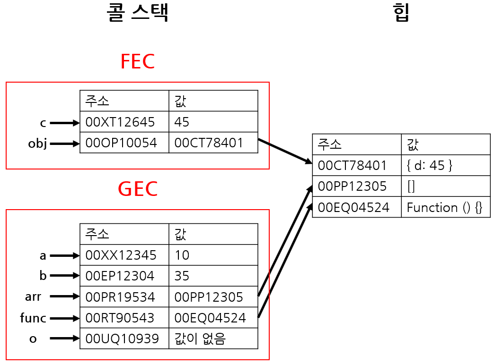
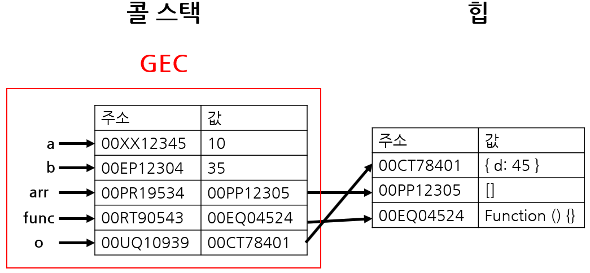

# 📚 메모리 힙(Memory Heap)과 콜 스택(Call Stack)


자바스크립트 엔진이 구동되면서 코드를 읽고 실행하는 과정에서 중요하게 여겨지는 두 가지 단계:

```
1. 변수, 함수 등의 정보를 특정한 장소에 저장하는 것
2. 현재 실행되고 있는 코드를 트래킹하는 작업
```

여기서 **정보를 저장**하는 공간이 **Memory Heap**이고, **실행 중인 코드를 트래킹**하는 공간이 **Call Stack**

<br>

---

## ✔ 원시 타입의 변수 선언과 할당

```javascript
// test1 - 1
let num = 26;
let newNum = num;
console.log(num, newNum); // 26 26
# 각각의 식별자가 같은 메모리 주소 가리킴

// test1 - 2
num += 1;
console.log(num, newNum); // 27 26

// test2
let myString = "cat"
myString = myString + "love"
```

1. 변수의 고유 식별자 "num" 생성
2. 메모리에 주소 할당
3. 생성된 주소에 값 저장

- test1 - 2에서 num + 1의 연산 결과가 확인되면 자바스크립트는 **메모리에 새로운 주소를 할당**하므로 num, newNum은 각각 다른 주소를 가리키게 됨
- test2에서 myString은 기존에 가리키던 메모리 주소 대신 `catlove`가 저장된 새로운 메모리 주소를 가리킴
- 자바스크립트의 원시 타입 데이터는 변경불가능(immutable)하므로 이렇게 동작

---

<br>

## ✔ 메모리 힙(Memory Heap)

객체, 배열, 함수 등 크기가 **동적**으로 변할 수 있는 **참조타입 값**을 저장  
쉽게 말하면, Memory Heap이라는 창고 속에 겉에 이름이 라벨지로 붙어 있는 참조 타입 값의 박스가 있는 것

<br>

- 갑자기 데이터가 커질 수도 있는, 배열과 객체처럼 정렬되지 않은 데이터들을 저장할 수 있음
- 변수, 함수 저장, 호출 등의 작업이 발생

<br>

### ➰ 메모리 누수(Memory Leak)

Memory Heap이 제대로 관리되지 않아 **메모리 공간의 범위를 넘어서서 정보들이 저장**되는 경우

- 과거에 사용되었고, 현재 필요 없는 데이터가 공간을 차지하고 있는 현상
- 가장 흔한 3가지 패턴

  - **Global Scope**에서 **전역 변수(var)**를 많이 생성하는 경우
  - **Event Listener** 사용 후 제거시키지 않는 경우
  - **setInterval()** 함수

  <br>

## ✔ 콜 스택(Call Stack)

1. **원시타입 값** 저장
2. 함수 호출의 **실행 컨텍스트(Execution Context)**를 저장

<br>

- 코드 실행에 따라 하나씩 스택이 쌓임 (LIFO)
- 그런 뒤 Memory Heap에서 작업 수행에 필요한 것들을 찾아 작업 수행

<br>

### ➰ 스택 오버플로우(Stack Overflow)


```javascript
function foo() {
  foo();
}
foo();
```

**작업이 수행되어 제거되지 않고 Call Stack에 쌓여 한정된 공간의 크기를 넘어서게 되는 경우**

- Call Stack에서 특정 작업을 수행하기 위해서 다른 작업이 필요할 경우, 다른 작업이 계속해서 위에 추가되기 때문에 나타남

<br>

## ✔ 메모리 힙, 콜 스택의 동작 예시

```javascript
let a = 10;
let b = 35;
let arr = [];
function func() {
  const c = a + b;
  const obj = { d: c };
  return obj;
}
let o = func();
```

### 1. Global Execution Context가 생성되고, 원시 값과 참조 값은 각각 Call Stack과 Heap에 저장


- a, b는 각각 10, 35의 값을 보유한 메모리 주소와 같다
- 참조 값
  - 변수의 고유 식별자 생성 (ex: arr)
  - Call Stack 메모리에 주소 할당 (런타임에 할당)
  - Memory Heap에 할당된 메모리 주소를 Call Stack의 값으로 저장 (런타임에 할당)
  - Memory Heap의 메모리 주소에 할당된 값(빈 배열[]) 저장

### 2. 함수 func()을 실행하면 새로운 Function Execution Context가 생성되고, 원시 값과 참조 값은 전과 동일하게 저장



- func()에서 return되는 obj = {d: 45} 값이 Memory Heap에 저장

### 3. func()이 객체 obj을 리턴하여 o에 저장되고, 함수가 실행되었으므로 FEC는 Call Stack에서 제거



- 전체 코드가 실행되고 나면 GEC도 Call Stack에서 제거
- Memory Heap의 객체를 참조하는 스택 값이 없으므로 가비지 컬렉터(Garbage Collector)에 의해 모두 제거
- 모든 수행 종료

<br>

## ✔ 가비지 컬렉터(Garbage Collector)


Call Stack과 Memory Heap의 공간은 언제나 **한정적**이므로 이를 **효율적으로 관리**하기 위해서 더 이상 효용가치가 없다고 판단되는 변수, 함수 등을 **실행 종료 후 Memory Heap**에서 제거하는 동작을 수행해 주는 도구

<br>

---

## ✔ 변수의 변경

```javascript
// good
let sum = 0;
sum = 1 + 2 + 3 + 4 + 5;

// bad
let numbers = [];
numbers.push(1);
numbers.push(2);
numbers.push(3);
numbers.push(4);
numbers.push(5);
```

> **변경**은 **메모리 주소의 변경**을 뜻함

- let은 메모리 주소 변경 가능
- const는 메모리 주소 변경 불가

### 오류 예시

```javascript
const myArray = [];
myArray = 3; //원시타입 할당 불가
myArray = ["a"]; //새로운 배열 할당 불가
```

- Call Stack에서 myArray는 Memory Heap의 주소를 값으로 가지는 어떤 객체로 저장되어 있는데, 원시 타입은 Memory Heap이 아닌 Call Stack의 값을 변경하려 하는 것이므로 오류 발생
- Memory Heap에서 ["a"]를 값으로 가지는 어떤 객체의 메모리 주소는 Call Stack의 값으로 들어가 있다. 그런데 myArray는 이미 const로 Call Stack에 어떤 메모리 주소를 가지는 객체로 저장되어 있고, 변경이 불가능하므로 오류 발생

<br>

> **let과 const의 중요성**
>
> 1. 미래의 버그를 사전에 방지한다.
> 2. const를 통해 선언된 변수는 반드시 선언과 동시에 초기화되어야하며, 이를 통해 개발자는 스코프적인 측면에서 더욱 신중하게 변수를 배치해야함을 강요받게 됩니다. 이는 궁극적으로 더 나은 메모리 관리 및 성능으로 이어지게됩니다.
> 3. 단지 코드를 보는 것만으로도 어떤 변수가 변경 불가능하고, 또 어떤 변수가 재할당이 가능한지 의사소통할 수 있기 때문입니다.

## ✔ 참고

[콜 스택(Call stack)과 힙(Heap)](https://github.com/baeharam/Must-Know-About-Frontend/blob/main/Notes/javascript/stack-heap.md)  
[자바스크립트 런타임 : 콜스택과 메모리 힙](https://soldonii.tistory.com/53)  
[\[JS\] 자바스크립트 동작 원리(콜 스택, 콜백 큐, 이벤트 루프)](https://velog.io/@graphicnovel/JS-%EC%9E%90%EB%B0%94%EC%8A%A4%ED%81%AC%EB%A6%BD%ED%8A%B8-%EB%8F%99%EC%9E%91-%EC%9B%90%EB%A6%AC)  
[<번역>자바스크립트의 메모리 모델](https://junwoo45.github.io/2019-11-04-memory_model/)  
[\[자바스크립트\] 콜스택/메모리힙 구조, 데이터 저장/참조 원리](https://curryyou.tistory.com/276)  
[MDN 호출 스택](https://developer.mozilla.org/ko/docs/Glossary/Call_stack)
