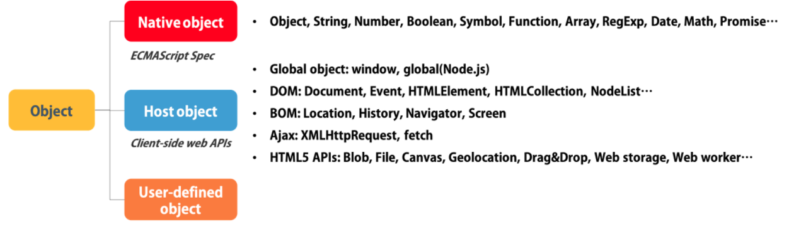

# 🖥 네이티브 객체(Native Object) vs 호스트 객체(Host Object)

 

 

## ✔ Native Object

Host 환경이 아닌, `ECMAScirpt 명세`에서 의미론적인 부분을 완전히 `정의`해 놓은 객체 (자바스크립트 언어의 일부에 해당)

###### _ECMAScirpt: 자바스크립트 언어 규약_

 

- 애플리케이션 전역의 공통 기능 제공
- 애플리케이션의 환경과 관계없이 언제나 사용 가능
- 각자의 프로퍼티와 메소드를 갖는다
- 종류
  - Object (constructor), Date, Math, parseInt, eval, string methods like indexOf and replace, array methods, ...
  - 값 속성 : NaN, Null, undefined, globalThis
  - 함수 속성 : eval(), parseInt(), isNaN() - 객체에 붙지 않고 전역으로 호출하는 함수
  - 기초 객체(fundamental obj) : Object, Boolean, Function, Symbol - 모든 객체의 기본 객체
    - 오류 객체 : Error, SyntaxError
    - 숫자/날짜 객체 : Number, Math, Date
  - 텍스트 처리 객체 : String, RegExp
  - 인덱스 콜렉션 : 인덱스값으로 정렬된 콜렉션. Array 포함

 

## ✔ Host Object

ECMAScirpt의 실행 환경을 완성하기 위해 `Host 환경에서 제공`하는 객체

 

- 자바스크립트 인터프리터가 내장된 호스트 환경에 정의됨
   - OS, Web browser, 노드, 런타임 등 실행 환경에 따라 제공 객체가 달라짐 
   - 예를 들어, 브라우저에서 동작하는 환경과 브라우저 외부에서 동작하는 환경의 자바스크립트(Node.js)는 다른 호스트 객체를 사용할 수 있음
- 크로스 브라우징 문제를 발생시키기도 함
- 종류
  - window, document, location, history, XMLHttpRequest, setTimeout, getElementsByTagName, querySelectorAll, ...
  - 전역객체(Global object !== Global Objects): 모든 객체의 유일한 최상위 객체 (브라우저의 window, 서버의 global 객체)
  - BOM(Browser Object Model): 브라우저 탭 또는 브라우저 창의 모델을 생성, BOM의 최상위 객체는 window 객체(현재 브라우저 창 또는 탭을 표현)
  - DOM(Document Object Model): 현재 웹페이지의 모델을 생성, DOM의 최상위 객체는 document 객체로 전체 문서를 표현
  - Event, Ajax 등

 

## ✔ 참고

[네이티브 객체 vs 호스트 객체](https://github.com/baeharam/Must-Know-About-Frontend/blob/main/Notes/javascript/native-host.md)  
[What is the difference between native objects and host objects?](https://stackoverflow.com/questions/7614317/what-is-the-difference-between-native-objects-and-host-objects)  
[\[TIL\] 호스트 객체(Host Objects)와 네이티브 객체(Native Objects)](https://velog.io/@bangina/FE%EB%A9%B4%EC%A0%91%EB%8C%80%EB%B9%84-%ED%98%B8%EC%8A%A4%ED%8A%B8-%EA%B0%9D%EC%B2%B4Host-Objects%EC%99%80-%EB%84%A4%EC%9D%B4%ED%8B%B0%EB%B8%8C-%EA%B0%9D%EC%B2%B4Native-Objects)   
[Standard built-in objects](https://developer.mozilla.org/en-US/docs/Web/JavaScript/Reference/Global_Objects   
[호스트 객체 (Host object) 와 내장 객체 (Native object) 의 차이점](https://jopemachine.github.io/2021/10/05/host-vs-native/)   
[네이티브 객체 & 호스트 객체](https://donguk.netlify.app/javascript/%EB%84%A4%EC%9D%B4%ED%8B%B0%EB%B8%8C-%EA%B0%9D%EC%B2%B4-&-%ED%98%B8%EC%8A%A4%ED%8A%B8-%EA%B0%9D%EC%B2%B4/)
